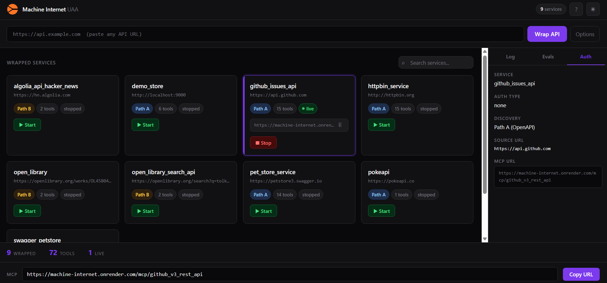
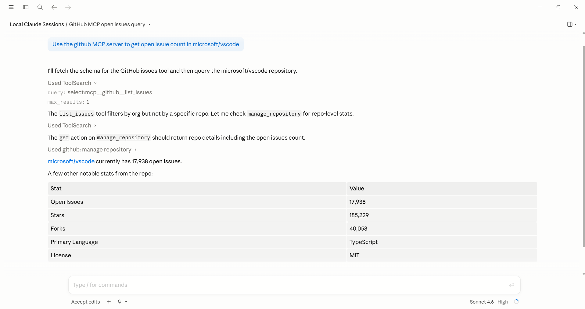

# Machine Internet

> Hosted MCP endpoints for any API. No setup required.

Point it at any URL. It discovers the API surface, condenses it into clean agent-friendly tools, and serves it as a live MCP endpoint your agent can call immediately.

**Live:** [machine-internet.onrender.com](https://machine-internet.onrender.com)


---

## Use a hosted endpoint right now

Works with Claude Desktop, Cursor, Cline, and any MCP-compatible client.

```json
{
  "mcpServers": {
    "github": {
      "command": "npx",
      "args": ["mcp-remote", "https://machine-internet.onrender.com/mcp/github_v3_rest_api", "--transport", "sse-only"]
    },
    "hn-search": {
      "command": "npx",
      "args": ["mcp-remote", "https://machine-internet.onrender.com/mcp/algolia_api_hacker_news", "--transport", "sse-only"]
    },
    "httpbin": {
      "command": "npx",
      "args": ["mcp-remote", "https://machine-internet.onrender.com/mcp/httpbin_service", "--transport", "sse-only"]
    }
  }
}
```

Or wrap any API yourself at [machine-internet.onrender.com](https://machine-internet.onrender.com). Paste a URL, get an endpoint.

---

## Available hosted endpoints

| API | Endpoint | Tools |
|---|---|---|
| [GitHub Issues](https://docs.github.com/en/rest/issues/issues) | `/mcp/github_v3_rest_api` | 15: list, create, update, comment, label |
| [HN Algolia Search](https://hn.algolia.com/api) | `/mcp/algolia_api_hacker_news` | 2: search articles, status |
| [httpbin](https://httpbin.org) | `/mcp/httpbin_service` | 15: inspect, auth, redirect |
| [Open Library](https://openlibrary.org) | `/mcp/open_library` | 2: books, affiliate links |
| [Open Library Search](https://openlibrary.org/search) | `/mcp/open_library_search_api` | 2: search books/authors, facets |
| [PokéAPI](https://pokeapi.co) | `/mcp/pokeapi` | 1: get Pokemon |

All endpoints are live and free. Base URL: `https://machine-internet.onrender.com`

Want an API that isn't listed? Wrap it yourself in 30 seconds on the dashboard.

---

## Demo

<!-- GIF coming soon: terminal running discover.py against httpbin, 73 endpoints to 15 tools -->


*The Machine Internet dashboard. 9 services wrapped, 72 tools available, live MCP endpoints with one-click copy.*


*Claude calling live [GitHub](https://github.com/microsoft/vscode) data through a Machine Internet MCP endpoint. 17,938 open issues as of today.*

---

## Who this is for

**Agent developers using LangChain, AutoGPT, or any MCP-compatible framework** who need to add an API as a tool without spending hours building a custom integration.

**Claude Desktop and Cursor users** who want tools beyond what's natively available.

**Teams with internal APIs** who want their agents to access proprietary services without writing MCP servers from scratch.

**Anyone building agents** who hits the wall where the tool they need doesn't have an MCP server yet.

---

## How it works

**Path A: OpenAPI spec detection**
Probes 20 standard locations for an OpenAPI or Swagger spec. If found, parses the entire API surface automatically. Zero LLM cost. Works on any documented API.

**Path B: Traffic sniffing**
If no spec exists, launches headless Chromium, observes XHR traffic while interacting with the page, and uses an LLM to infer a schema from what was captured. Works on SPAs and undocumented services. Verified on [PokéAPI](https://pokeapi.co) and [HN Algolia](https://hn.algolia.com/api) (which calls a different TLD than its website).

**Condensation**
Raw API specs can have hundreds of endpoints. An LLM collapses them into 10-15 clean tools with `verb_noun` names and descriptions that tell agents exactly when to use each one. A 400-endpoint CRM becomes `get_customer`, `create_deal`, `log_interaction`.

**Serving**
The condensed schema is served as a standard SSE-based MCP server. Any MCP-compatible client connects immediately and makes real calls against the real service.

---

## Wrap your own API

Using the hosted dashboard (no install):

1. Visit [machine-internet.onrender.com](https://machine-internet.onrender.com)
2. Paste any URL into the wrap bar
3. Copy the MCP endpoint URL
4. Add it to your agent config

Using the CLI (self-hosted):

```bash
# Any API with an OpenAPI spec
python discover.py --url http://httpbin.org

# Large specs: use --spec and --tags to focus
python discover.py \
  --url https://api.github.com \
  --spec https://raw.githubusercontent.com/github/rest-api-description/main/descriptions/api.github.com/api.github.com.json \
  --tags issues

# No spec: use traffic sniffing
python discover.py --url https://hn.algolia.com --traffic

# Serve the result
python serve.py --schema schemas/httpbin_service.json --port 8100
```

---

## Verified on

| Service | Method | Tools | Notes |
|---|---|---|---|
| [GitHub Issues API](https://docs.github.com/en/rest/issues/issues) | Path A + `--spec --tags issues` | 15 | 1,186 endpoint spec, tag filter to issues |
| [httpbin.org](https://httpbin.org) | Path A auto-detected | 15 | Spec at `/spec.json` |
| [HN Algolia](https://hn.algolia.com/api) | Path B traffic sniff | 2 | SPA, API on different TLD |
| [PokéAPI](https://pokeapi.co) | Path B traffic sniff | 1 | No spec anywhere |
| [Open Library](https://openlibrary.org) | Path B traffic sniff | 2 | Mostly SSR, search page works |
| [Petstore v2](https://petstore.swagger.io) + [v3](https://petstore3.swagger.io) | Path A auto-detected | 14-15 | Standard Swagger paths |

---

## Condensation quality

Eval suite measures coverage against ground truth schemas. Pass threshold: 70%.

| Dataset | Endpoints | Coverage | Score |
|---|---|---|---|
| Demo store | 6 | 100% | **100% PASS** |
| GitHub repos + issues | 40 | 100% | **100% PASS** |
| GitHub API | ~40 | 73% | **84% PASS** |
| httpbin | 73 | 54% | **72% PASS** |

---

## Self-hosted setup

```bash
git clone https://github.com/chetanty/machine_internet
cd machine_internet
pip install -r requirements.txt
playwright install chromium
cp .env.example .env
```

Add at least one key to `.env`:

```
OPENAI_API_KEY=sk-...        # recommended, no daily quota
GEMINI_API_KEY=your-key      # free tier, 20 req/day on flash
```

The AI client tries OpenAI first, then falls back through multiple Gemini models automatically on quota exhaustion.

Run the dashboard:

```bash
python dashboard.py   # http://localhost:7000
```

---

## Project structure

```
discover.py       discover any API, save condensed schema
serve.py          serve a schema as a live MCP endpoint
dashboard.py      web UI: wrap, start, stop, manage services
src/
  discovery/      Path A (OpenAPI) and Path B (traffic sniffing)
  condensation/   LLM condensation and eval runner
  serving/        pure ASGI SSE MCP server and smart executor
  auth/           Fernet-encrypted credential vault
  ai/             OpenAI + Gemini fallback client
evals/            ground truth schemas and scoring scripts
```

Full technical breakdown: architecture decisions, eval results, build log: [BUILD_REPORT.md](BUILD_REPORT.md)

---

## Contributing

Issues and PRs welcome. If you wrap an API that works well, open a PR to add the schema to the `schemas/` directory and the endpoint to this README.

---

## License

Apache 2.0
